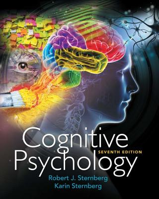

## A Clojure Fusion of Symbolic and Data Driven AI

Huahai Yang, Ph.D.
<br>
Co-founder & CTO
<br>
Juji, Inc.

---
@snap[west]
@css[bio-about](Cognitive psychologist<br>Computer scientist)
<br><br><br>
@css[bio-about](Coding in Clojure since 2012)
@snapend

@snap[east bio]
@css[bio-headline](Huahai Yang)
<br>
@css[bio-byline](@fa[github pad-fa] huahaiy @fa[twitter pad-fa])
<br>

@snapend

---

### Juji Builds Chatbot Platform

- It is easy to pass Turing Test, been done in 70s'
- PARRY, 33 psychiatrists cannot tell from paranoid patients


---

@snap[north span-100]
### Juji Builds Chatbot Platform
@snapend

@snap[west span-60]
@ul[](false)
- It is hard to build **useful** chatbots
  - interview people to collect feedback
  - help students learn
  - screen job candidates
  - check up on patients
  - receive visitors
@ulend
@snapend

@snap[east span-40]

@snapend

---

@snap[north span-100]
### Juji Approach:<br>Symbolic + Data Driven
@snapend

@snap[west span-60]
@ul[](false)
- Symbolic system as the bones
- Data-driven component as the flesh
- Done in a Clojure DSL
@ulend
@snapend

@snap[east span-40]

@snapend

---

### AI Summer is Back

- Watson Jeopardy beats human
- AlphaGo beats human
- Many AI assistants on phone and in home
- Many commercial products in enterprises

---

### Rise of Deep Learning (DL)

- Neural networks with many layers
- Recently hugely successful
- For many: @color[red](AI = DL)

---

### DL Solves Perception Problem

@quote[Perception is the organization, identification, and interpretation of sensory information in order to represent and understand the presented information, or the environment.]

- DL maps raw data into:
  - known labels (classification)
  - desirable numbers (regression)
  - fixed length vectors (embedding)

---

@snap[north span-100]
### Perception Feels like Intelligence
@snapend

@snap[west span-40]

@snapend

@snap[east span-40]

@snapend

@snap[south list-content span-100]
@ul[](false)
- @size[12](Reporter: "How many moves do you see ahead while playing chess?")
- @size[12](Capablanca: "Only one, but it's always the right one.")
@ulend
@snapend

---

@snap[north span-100]
### Perception is not yet Intelligence
@snapend

@snap[west]

@snapend

@snap[east]

@snapend


---

@snap[north span-100]
### Perception Cannot be Solved with Data Alone
@snapend

@snap[west list-content-concise span-40]
@ul[](false)
Bottom-up
    * data driven
    * sub-symbolic
@ulend
@snapend

@snap[east list-content-concise span-60]
@ul[](false)
Top-down
    * goal/hypothesis driven
    * symbolic (human-readable)
@ulend
@snapend

---

### Time to Bring back Symbolic AI

- (Semi-)solving perception lays the foundation for symbolic AI
- The same forces leading to the rise of DL apply to symbolic AI
  - More powerful hardware
  - Better software tools and practices
  - More abundant realistic data

---

### Trade-offs

- Data driven
  - Easy to defeat/abuse by adversaries (e.g. Tay)
  - Hard to debug and bend it to the creator's will
  - By design, unlikely to be fixable

- Symbolic
  - Easy to build rigid/brittle systems
  - Hard to develop, for it is hard for human to think like machines
  - Fixable with *enough* human efforts

---
### Two Roads to Integration

- Extract symbols out of sub-symbolic, then put symbols back
    - Mimic nature
    - Not yet practical

- Symbolic + sub-symbolic
    - Engineer's method
    - Practical today

---

### Symbolic + Data Driven

- Symbolic system as the bones
  - for its potential for growth and adaptability, despite the rigidity
- DL/ML component as the flesh
  - for its flexibility and ease of development, despite the obscurities

---

### REP: a Chatbot Authoring DSL

- Used for interview/survey
- 2X completion rate, 26% better quality responses

@quote[the whole time i was doing this survey it felt like i was talking to a friend and sharing the same common ground. i loved that i wish it didnt have to end]

@quote[very dynamic and very fluid conversation you have great quality thanks]

---

### Deftopic: the Building Block

- Topic: a set of rules

```clojure
(deftopic hello-world
  []

  []
  ["Hello world!"])

```

@[1]
@[2]
@[4]
@[5]

---

### Production Rule

- Rule: trigger (if),  action (then) and associated followup topics
- Followup topics are primed when a rule fired

```clojure
[:1 hello hi hey howdy]
["Nice to meet you!"]
(talk-about-wheather)
```

@[1]
@[2]
@[3]

---

### Topic Compositions

- A topic may include rules of other topics

```clojure
(deftopic greetings
  []
  {:include-before [(morning-greetings)
                    (evening-greetings)]}

  [:1 hello hi hey howdy]
  ["Hello"])

```
@[3-4]

---

### Patterns

- Token based regular expressions

```clojure
[I love :1-. pizza]
[I love ? [:1- pizza bacon sausage]]
[:0. "I love pizza"]
```

@[1] sequence pattern with a wild card
@[2] sequence patterh with an one or nothing and a multiple alternative
@[3] start pattern and a string pattern, where no lemmatization is done

---

### ML Based Tag and Class Patterns

- Tags for annotating text, keywords for placeholders of content classes
- Parts of speech, phrases, and entities

```clojure
[he #pos/verb dog tree]
[she love :phrase/NP]
[I work at :entity/org]
[it will be done in :entity/duration]
```

@[1]
@[2]
@[3]
@[4]

---

### DL/ML for Classification Functions

- Neural networks are universal **function** approximator, should be used as such

```clojure
[programming
 (input-in-this-category? "self-intro-relevance" 0.7)]
["You must be a smart person"]
```

@[2]

- Patterns are `and` together in a rule
- Rules are `or` together, so a topic matches a DNF

---

### DL for Similarity Based Matches

- Calculate similarity using Tensorflow sentence embedding

```clojure
[(> (max-similarity-score
     ["What does your product cost?"
      "How much does your product cost?"
      "What's the price of your product?"
      "How expensive is your product?"])
    0.9)]
```

---

### Roles

- ML/DL models cover broad cases
- Symbolic covers specific cases
  - misses by DL/ML
  - detailed refinement

```clojure
[(input-in-this-category? "self-intro-relevance"
                          0.7)]
([programming]
 "You must be a smart person."

 [art]
 "I enjoy art too."

 "Thank you for the introduction.")
```

@[1=2]
@[3-4]
@[6-7]
@[9]

---

### Meta-circularity

- Turn a topic into a function, then use the function in another topic

```clojure
[(create-topic-func
    custom/why-u-here :extract-why-u-here)
 "I see, you are here to "
 (exec-topic-func :extract-why-u-here)]
```

@[1-2]
@[4]


---

### Automatic Dialog Management

- REP is a declarative language
- System pushes topics around
  - Agenda queue
  - Ad-lib queue
  - Exception queue
  - Main stack

---

### Juji Architecture


---

###  EDN Data all the Way


1. User select chat template
2. User configure chat in GUI
3. Generate script from GUI
4. Chat: script compiles and runs

---

### Conclusion

- Clojure is a great choice for doing practical AI
  - Lisp was and still is the language of symbolic AI
  - Data orientation of Clojure makes it easy to integrate symbolic and data-driven AI

---

@snap[east span-50]

@snapend

@snap[west span-50]
Huahai Yang
<br>
Juji, Inc.
<br>
https://juji.io

@snapend
