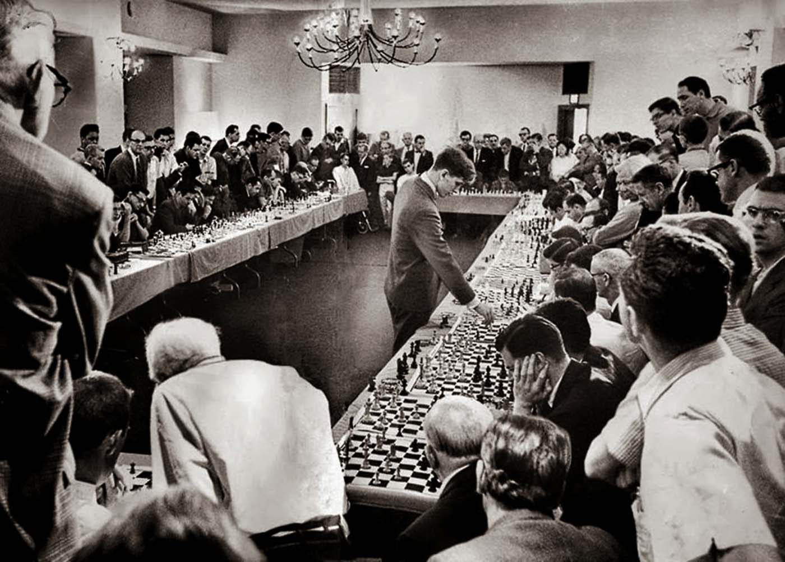

## A Clojure Fusion of Symbolic and Data Driven AI

Huahai Yang
 
Juji, Inc.

---

### AI is Back

- Watson Jeopardy
- AlphaGo beats human
- Many AI assistants on phone and in home
- Many commercial products in enterprises

---

### Rise of Deep Learning (DL)

- Neural network with many layers
- Recently hugely successful
- For many: AI = DL

---

### DL Solves Perception Problem

@quote[Perception is the organization, identification, and interpretation of sensory information in order to represent and understand the presented information, or the environment.]

- Map raw data into
  - known labels (classification)
  - desirable values (regression)
  - fixed length vectors (embedding)

---

### Perception is not yet Intelligence

- Perception is just a beginning component

---

### Perception may Feel like Intelligence

- Surprising Number of Cognitive Problems Can be Solved as Perception Problems

---

### Perception cannot be Solved with Data Alone

- Bottom-up: data driven, sub-symbolic
- Top-down: goal driven, symbolic

---

### Time to Bring back Symbolic AI

- Concept of symbolic AI
- The same forces leading to the rise of DL apply to symbolic AI
  - More powerful hardware
  - Better software tools
  - More abundant data
- (Semi)Solving perception lays the foundation for symbolic AI

---

### Two Roads to Integrate Symbolic with Sub-symbolic

- Neural network -> symbolic -> neural network
  - Mimic nature's method

- Symbolic + Neural network
  - Engineer's method

---

### Build a Conversational Agent Platform

- It is easy to pass Turing Test: has been done in 60s'
- It is harder to build **useful** conversational agent

---

### Weakness of Data Driven Conversational Systems

- Easy to defeat/abuse by adversaries
- Hard to debug and bend it to the creator's will
- Both are by design, no fixable

---

### Weakness of Symbolic Conversational Systems

- Easy to build rigid/brittle systems
- Hard for humans to think like machines
- Both are fixable with *enough* human efforts

---

### Practical AI = Symbolic + Data Driven

- Symbolic system as the bones
  - for its potential for growth and adaptability, despite the rigidity
- DL/ML component as the flesh
  - for its flexibility and ease of development, despite the obscurities

---

### REP: a Clojure based Practical Conversational AI

- Lisp was and still is the language of Symbolic AI
- Data orientation of Clojure makes it easy to integrate symbolic and data-driven AI

---

### Deftopic: the Building Block

- Hello World!

---

### Production Rules: the Mortar

- Triggers => DNF
- Actions

---

### Patterns: the Bricks

- Just data
- Optimized for speed

---

### Tagged Literals: Annotating Text

- Parts of speech
- Phrases
- Entities
- Regular expression tokens

---

### Embed DL/ML are Functions

- Neural networks are universal **function** approximator,
- Should be used as such

---

### DL for Similarity Based Matches

- Tensorflow USE

---

### Rules to Fix Bugs

- Cover specific cases missed by DL

---
### Meta-circularity: Entity Extraction as an Example

- Turn a topic into a function
- Use the function in a topic

---

###  Generate Code from GUI

- Generate topics as data

---

### Automatic Dialog Management

- Push topics around as data

---

### Putting Together: Juji Architecture

---

### Conclusion

- Clojure is a good choice for doing practical AI
